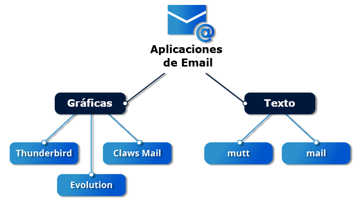
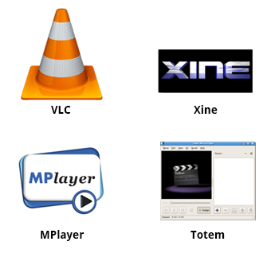

Es una red global que permite a todos los usuarios realizar multiples tareas

aplicaciones compatibles con la red:

- Navegadores web
- Clientes de correo electronico
- aplicaciones multimedia de streaming
- chats de retransmision por internet
- software para conferencias
- ![[12.png]]
## Navegadores web

- Firefox
- Google Chrome
- Cromo
- Epiphany (web renombrada)
- Konqueror
- linx, linx, w3m
- Opera
## **Aplicaciones de correo electrónico**

Las aplicaicones de correo eletronico permiten enviar y recibir mensajes a traves de internet

la mayoria usa el protocolo de acceso a mensajes de internet (Internet Message Access Protocol IMAP) o el anterior protocolo, Protocolo de oficina postal (Post Office Protocol POP) la mayoria de correos electronicos tambien lo muestra en formato html

### linux admite los siguientes tipos de correos

- clientes de correos electronico graficos como thunderbierd evolution y claws mail
- clientes de correo electronico en modo texto como mutt y mail
- Todos los clientes basados en navegadores web como Gmail, Yahoo Mail y Office 365.
ejemplo
	
## otras aplicaciones de internet

|**Aplicación**|**Uso**|
|---|---|
|**FileZilla**|Cliente FTP gráfico intuitivo que admite FTP, Protocolo de transferencia segura de archivos (SFTP) y FTP Secured (FTPS). Se utiliza para transferir archivos a/desde servidores (FTP).|
|**Pidgin**|Para acceder a gTalk, AIM, ICQ, MSN, IRC y otras redes de mensajería.|
|**Ekiga**|Para conectarse a redes de protocolo de voz sobre Internet (VoIP).|
|**Hexchat**|Para acceder a las redes de Internet Relay Chat (IRC).|
## Aplicaciones de oficina

la mayoria de os tienen una suites de oficinas preinstalados , una suite es una coleccion de programas acoplados que se utiliza para crear o editar diferentes tipos de archivos como:

- Texto (artículos, libros, informes, etc.)
- Hojas de cálculo
- Presentaciones
- Objetos gráficos.

La mayoria de los linux ofrecen libre office
## Componentes libreOffice

Las aplicaciones de libre office son:

- Writer: Procesamiento de textos
- Calc: Hojas de cálculo
- Impress: Presentaciones
- Dibujar: Crea y edita gráficos y diagramas.

estos pueden leer y escribir formatos de documentos no nativos
## Aplicaciones de desarrollo

Linux ofrece muchas herramientas gratuitas de desarroyo como:

- Editores avanzados personalizados para las necesidades de los programadores como vi y emacs
- compiladores (tales como gcc y clang para programas en c y c++) para todos los idiomas informaticvos como los nuevos golang y rust
- depuradores como gdb y varios frontales graficos y muchas otras herramientas de depuracion como valgrind
- programas de medicion y monitoreo de rendimiento
- entornos de desarrollo integrado Eclipse y vscode
## Reproductores de sonido

|**Aplicación**|**Uso**|
|---|---|
|**Amarok**|Reproductor MP3 maduro con interfaz gráfica, que reproduce archivos de audio y vídeo y transmite (archivos de audio online). Permite crear una lista de reproducción que contiene un grupo de canciones y utiliza una base de datos para almacenar información sobre la colección de música.|
|**Audacity**|Se utiliza para grabar y editar sonidos. Se puede instalar rápidamente a través de un gestor de paquetes. Audacity tiene una interfaz sencilla para empezar.|
|**Rhythmbox**|Admite una gran variedad de fuentes de música digital, incluida la transmisión de audio por Internet y podcasts. La aplicación también permite buscar audio concreto en una biblioteca. Soporta _listas de reproducción inteligentes_ con un _actualización automática_ , que puede revisar las listas de reproducción según los criterios de selección especificados.|
## Reproductores de video

Los reproductores de video pude representar entradas de muchas fuentes de diferentes ya sea local de la maquina o internet

Los sistemas linux ofrecen varios reproductores de pelis

- VLC
- MPlayer
- Xine
- Totem
## Editores de video

linux ofrece varios editortes de video

|**Aplicación**|**Uso**|
|---|---|
|**Cinepaint**|Retocar fotograma por fotograma. Cinepaint se utiliza para editar imágenes de un vídeo.|
|**Blender**|Crear animación y diseño 3D. Blender es una herramienta profesional que utiliza el modelado como punto de partida. Existen herramientas complejas y potentes para capturar, grabar, editar, mejorar y crear vídeo de cámara, cada una de ellas con su propio enfoque.|
|**Cinelerra**|Capturar, redactar y editar audio/vídeo.|
|**FFmpeg**|Grabar, convertir y transmitir audio/vídeo. FFmpeg es un conversor de formatos, entre otras cosas, y tiene otras herramientas como **ffplay** y **servidor de ffserver**.|
|||
## **GIMP (Programa de manipulación de imágenes GNU)**

Los edictores graficos te permiten crear editar ver y organizar imagenens en varios formatos

Formatos que lo permite

- JPEG
- PNG
- GIF
- TIFF

gimp es una herramienta de retoque y ediion de imagenes y esta disponible en linux de forma gratuita es simila a adobe, sus aracteristicas son:

- Puede manejar cualquier formato de archivo de imagen.
- Tiene muchos complementos y filtros para fines especiales.
- Proporciona información exhaustiva sobre la imagen, como capas, canales e histogramas.

|**Utilidad gráfica**|**Uso**|
|---|---|
|**eog**|Eye of Gnome (eog) es un visor de imágenes que proporciona capacidad de presentación de diapositivas y algunas herramientas de edición de imágenes, como rotar y cambiar el tamaño. También puede recorrer las imágenes de un directorio con solo un clic.|
|**Inkscape**|Inkscape es un editor de imágenes con muchas funciones de edición. Funciona con capas y transformaciones de la imagen. A veces se compara con Adobe Illustrator.|
|**Convert**|Convert es una herramienta de línea de comandos (parte del conjunto de aplicaciones ImageMagick) que puede modificar los archivos de imagen de muchas maneras. Las opciones incluyen conversión de formato de archivo y numerosas opciones de modificación de imágenes, como desenfoque, cambio de tamaño, despeckle, etc.|
|**Scribus**|Scribus se utiliza para crear documentos utilizados para publicar y proporcionar un entorno  _Lo que ves es lo que obtienes (What you see is what you get WYSIWYG)_. También proporciona numerosas herramientas de edición.|