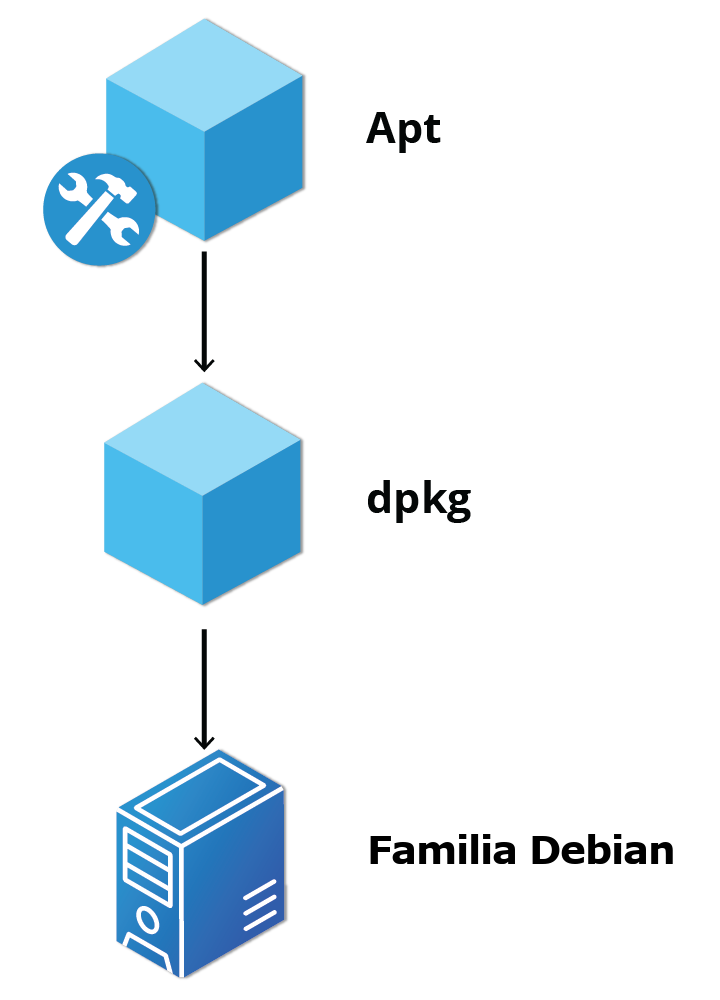
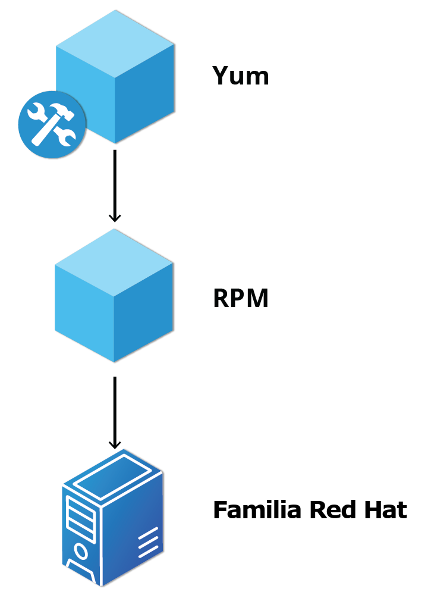

## Configuracion del sistema 
la configuraacion del sistema te permite controlar las configurqaciones basicas y los ajustes de escritorio 
## Ajustes de gnome
Ajustes gnome (gnome-tweak-tool) es una herramienta para configuracion devido a que algunos linux no traen esta opcion 
Las cosas inportantes como themas y extensiones se hacen atreves de esta herramienta 
Pero las mas recientes versiones de gnome ya no usan gnome-tweaks ahora se configura usando la aplicación de extensiones gnome (gnome-extensions-app)
## Configuracion de fecha y hora 
Linux usa la hora cordinada universal (UTC) los horarios dependen de la zona horaria del sistema para obtener el tiempo adecuado 
## Protocolo de hora de red 
Network time protocol (protocolo de la hra de red) NTP es el protocolo mas fiable para establecer hora local consultando los servidores de internet 
## Resolucion de pantallas 
Para obtener la resolucion de pantallas actual el comando es: **/tmp> $ xdpyinfo | grep dim** 
## Configuracion de red 
El administrador de red Network manager se desarrollo para que las cosas sea mas faciles y uniformes configura redes cableadas e inalambricas y crea redes privadas virtuales VPN 
configuracion de red:
	![[9.png]]
## Conexion cableada e inalambrica
La interface de harware y la señal se detectan sola y de forma automatica el administrador de red lo que hace la configuracion de la red mediante el protocolo de configuracion dinamico DHCP
La configuracion estatica tambien lo permite que no usa dhcp y puedes configurar la MAC si tu harware lo permite 
## Conexiones VPN y banda ancha movil 
Se puede configurar una conexion de banda ancha movil con el network Manager que abrira un asistente para configurar los detalles de conexion para cada conexion
El network Manager tambien puede administrar tus conexiones VPN 
Puedes obtener soporte para VPN como un paquete separado de tu distribuidor Debes instalar este paquete si tu VPN preferida no es compatible 
## Instalacion y actualizacion de software 
Cada paquete en un distribucion de linux proporciona una pieza del sistema 
Los paquetes dependen unos de otros 
todos los paquetes tienen un nivel inferior que se encarga de desempaquetar los paquetes y colocarlos en los lugares correctos 
## Paquetes debian 
**dpkg es el gestor de bajo nivel de paquetes debian con esto se puede instalar quitar y compilar paquetes este a diferencia de los gestores de paquetes de nivel supoerior no descarga ni isntala paquetes automaticamnete**

El sistema de gestion de paquetes de nivel superior es el **apt**
ejemplo 
	
## Gestores de paquetes red hat 
**rpm** es el gestor de paquetes de bajo nivel que a sido adoptado por open suse y otras distribuciones

El gestor de paquetes de alto nivel de red hat actualmente es el **dnf aunque antiguamente era yum**
ejemplos 
	
## Gestor de software Yast de openSUSE 
es un gestor de paquetes graficos de open suse 
