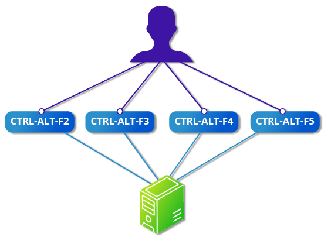
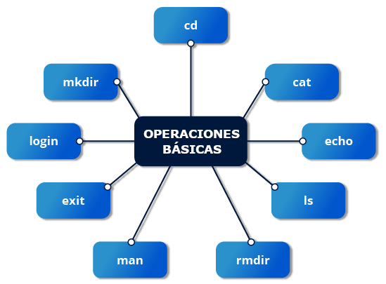
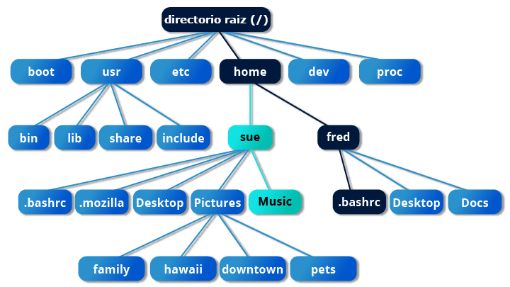
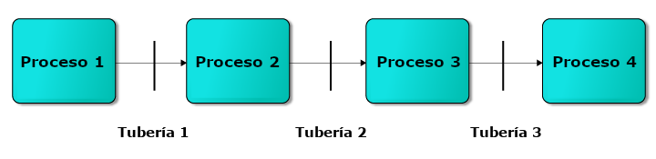
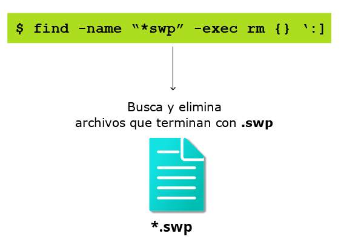
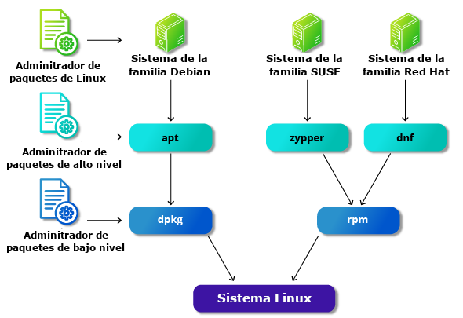
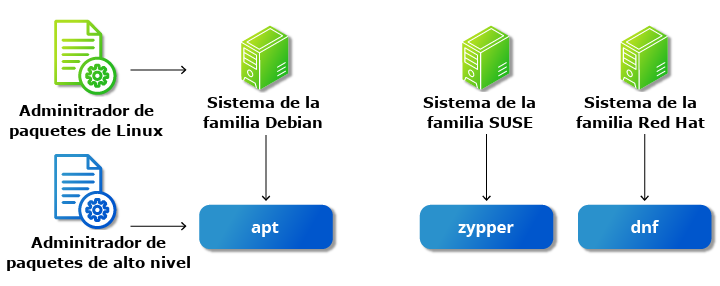

## Introduccion a la linea de comandos

Ventajas:

- No se incurre en sobrecargar de la GUI
- Todas las tareas se llevan acabo desde la linea de comandos
- puedes implementar script para tareas repetitivas
- puedes conectarte a quialquier maquena de forma remota
- puedes iniciar aplicaciones graficas desde la cli
- la interface de linea de comandos no varia
## uso de un terminal de texto en el escritorio grafico

Un emulador de terminal emula un terminal i9ndependientemente dentro de una ventana del escritorio

gnome-terminal se utiliza para emular un terminal de modo texto en una ventana

existen muchas mas emuladores de terminal como:

- xterm
- konsole de KDE
- terminator
## Utilidades basicas

Las utilidades basicas para la linea de comandos son

- cat: lee un archivo, cat tambien sirve para crear archivos de esta forma Escritorio>cat
- head: muestra las primeras lineas de un archivo
- tail: muestra las ultimas lineas de un archivo
- man: se utiliza para ver la documentacion de un comando
## Lineas de comandos

las lineas de comandos de shell tienen tres elementos basicos

- comandos:
    - es el nombre del programa que quieres ejecutar
- opciones:
    - esto modifica lo que puede hacer el comando suelen comenzar por -p o —print
- Argumentos
    - el argumento representa lo que opera el comando

Algunos comandos carecen de argumento u opcciones
## Sudo

Comando qque se utiliza para otorgar provilegios de administrador

(super usuario)

Si tu sistema no tiene configurado sudo para que lo puedas usar podemos configurarlo nosotros mismos de esta forma

1. en la terminal una vez abierta escribimos en comando **su** e introducimos la contraseña
2. necesitamos crear un archivo de configuracion para que te permita usar sudo este archivo se crea en un directorio con el mismo nombre de usuario que le as dado en el directorio sudoers.d como por ejemplo: echo “kami_hacker ALL=(ALL) ALL” > /etc/sudoers.d/kami_hackers
3. por ultimo devemos de darles los permisos correspondientes a dicho archivo de esta forma chmod 440 /etc/sudoers.d/kami_hackers

Por ultimo nos pedira la contraseña que usaremos en nuestro sudo siempre
## Cambiar entre la GUI y la linea de comandos

Linux nos permite cambiar entre la interfaz grafica y la linea de comandos cuando lo necesitemos

Normalmente los servidores no utilizan interfaz grafica devido a que es mas facil de soprotar y mantener el sistema ajustado

## Terminales virtuales (Virtual Terminals VT)

son seciones de consola que utilizan toda la pantalla y el teclado fuera de un entorno grafico

se le llama virtuales por que aunque puede haber varios activos solo hay uno a la vez un vt no es lo mismo que unaventana terminal de linea de comandos

se reserva vt del 1 al 7

el ejemplo de uso es cuando tienes problemas con el entorno grafico lo activas para solucionarlo y luego vuelves a el

Para activarlo es pulsar la tecla ctrl + alt + f1 o los siguientes asta el f7 vt puedes tener

si quieres volver al gui pulsa el ctrl + alt + el f donde estes y saldra a la gui

## Desactivacion del escritorio grafico

En las distribuciones de linux puedes detener la GUI y activarla los comandos son:

- para detener: sudo systemctl stop **lightdm**(o de forma acortada sudo telinit 3)
- para activar: sudo systemctl start **lightdm**(o de forma acortada sudo telinit 5)

En las versiones de Ubuntu anteriores a 18.04 LTS, ****sustituye **lightdm** por **gdm**.

esto es solo util si se combina con el vt ya que si no no te saldra una pantalla en negro y no te dejara hacer nada

## Operaciones básicas

## Inicio y salida de sesion 
En el terminal de texto te solicitara el login y una vez escrito la contraseña que ni siquiera se vera los * a no ser que lo configures
Otra forma de iniciar sesion es conectarte mediante SSH Secure SHELL 
de esta forma ponemos en la terminal ssh "nombre de usuario"@"nombre de la maquina a conectar" nos pedira la contraseña y la pondremos de esta forma estaremos conectados a una maquina de forma remota

### Reiniciado y apagado

Comandospara apagar el pc de forma controlada

- **halt** sirve para detener es sistema operativo de manera segura
- **poweroff** sirve para apagar el sistema operativo en si
- **shutdown - h** de esta forma se apagara el sistema operativo despues de un minuto si no le establecemos la hora por defecto nosotros puede ir acompañado de un mensaje de advertencia para demas usuaros
- **reboot**: reinicia el sistema operativo
- **shutdown** -r sirve para reiniciar el sistema tambien
- **Ejemplo de como programar un apagado**
    
    sudo shutdown -h 10:00 “apagado de mantenimiento”sudo
- **ejemplo de como apagar o resetear un equipo**
    
    sudo systemctl poweroff esto apaga el equipo
    
    sudo systemctl reboot es reinicia el equipo
- **which** "nombre de la app"
    - este comando averigua donde esta exactamente la app que buscamos
- **whereis** "nombre de la app"
    - este comando hace lo mismo pero con una busqueda mas amplia
    - tambien localiza ficheros de fuentes y man empaquetados which
### Accesos directos

Para navegar a tu directorio personal de tu usuario existe el cmando cd $HOME esto es un atajo lo cual estes en el directorio que estes volveras a tu directorio principal es muy util `tambien se puede hace con **cd ~**

comandos mas usados para navegar: cd -0

|**Comando**|**Resultado**|
|---|---|
|**pwd**|Muestra el directorio de trabajo actual|
|**cd ~** o **cd**|Cambiar a tu directorio personal (el nombre del método abreviado es **~** (tilde))|
|**cd ..**|Cambio al directorio padre (**..**)|
|**cd -**|Cambio al directorio anterior (**- (menos)**)|
### Accesos directos

Comandos pushd y popd

- **pushd "ruta"** este comando lo que hace es guardar en una pila la ruta que quieras darle para luego usarla y navegar de forma mas rapida a dicha ruta sin necesidad de recordar las rutas
- **cd popd** este comando te hace navegar al ultimo directorio guardado en la pila y lo elimina para dejar paso al otro que as guardado usando pushd
- **dirs** este comando me muestra toda la pila donde he ido guardando los directorios
### Ruta relativa y absoluta

Existen dos formas

- ruta absoluta
    - parte desde el directorio raiz / y luego sigue el arbol asta el directorio donde queremos llegar ejemplo /usr/bin
- ruta relativa
    - Esta parte desde el directorio donde estamos ubicados sin necesidad de poner la ruta desde el directorio raiz / como por ejemplo ~/Desktop esto es util si queremos ir desde nuestra posicion en el directorio actual a otro directorio mas abajo de donde estamos pero si queremos subir es mas factible usar ruta absoluta
        
    - **ejemplo de como escalar directorios con ruta absoluta y relativa**
        
        cd /usr/bin
        
        cd ../../usr/bin
        
        en este caso es mas factible la absoluta ya que estamos escalando directorios

### Exploracion del sistema de archivos

Para tener una vision mas clara de los directorios podemos usar el comando **tree** y para oprimir los archivos y solo ver los directorios podemos usar **tree -d**

Tambien para ver solo los directorios que hay en el directorio que nos encontramos podemos usar el comando **dir**

|**Comando**|**Uso**|
|---|---|
|**cd /**|Ir al directorio raíz (/) (o a la ruta que proporciones)|
|**ls**|Enumera el contenido del presente directorio de trabajo|
|**ls —a**|Enumera todos los archivos, incluidos los archivos y directorios ocultos (aquellos cuyo nombre empieza por .)|
|**tree**|Muestra una vista en árbol del sistema de archivos|
### Exploracion de sistemas de archivos

comandos utiles:

- df -h
    - nos muestra la cantidad de espacio disponible en el disco y la que hemos usado mas el tamaño quie contienen ruta y demas de una forma mas entiendible para el umano

### Enlaces duros

Un enlace duro es enlanzar dos archivos o directorios para que contenga el mismo inodo que es la referencia numerica unica que tiene cada archivo

los enlaces duros sirven para ahorrar espacio de almacenamiento relacionando archivos entre si con el mismo inodo ya que es como si tuvieramos un archivo

La desventaja es que si borrasemos uno de los archivos relacionados el inodo segiri existiendo y ocupando memoria

para eliminarlo completamente se deveria de eliminar todos los enlaces duros asta el origuinal

- creacion de enlace duro
    
    touch archivo1.txt
    
    ln archivo1.txt archivo2.txt
    
    de esta forma se crea un enlace lo cual comparte el mismo inode
    

Para ver los inode de un archivo se utiliza **ls -li y muestra una referencia numerica**

### Enlaces suaves o simbolicos

Un enlace suave se crea con el comando

- ln -s archivo1 archivo2
    
    - esto crea un enlace que no ocupa demasiado espacio ano ser que el nombre sea largo es muy util ya que es una forma de acceder a un contenido desde un sitio diferente y poder modificarlo desde un sitio diferente a donde fue creado los enlaces blandos sirven para archivos directorios o incluso particiones de dicos y otros medios los enlaces suabes crean inodos diferentes a diferencia del duro
        
    - ejemplo de enlaces blandos
        
        ln -s archivo1 Desktop/archivo2
        
        esto crea un enlace suave del archivo1 al directorio puduendo acceder en los dos directorios
        
    
    ⚠️**a la hora de crear un enlace suiave de un directorio o archivo hay que poner la ruta absoluta como por eljemplo ln -s $HOME/proyectos $HOME/Desktop/proyectos**
## Navegacion por el hiscorico de directorios

- El comando **cd** te recuerda donde estuviste por ultima vez
    
- el comando **cd - te permite volver al directorio anterior.**
    
- El comando **pushd** inserta los directorios en uina lista para luego acceder a el
    
- el comando **pop** te envia de vuelta a esos directorios al ultimo que se a guardado en dicha lista
    
- el comando **dirs** muestra los directorios
## Trabajo con archivos

Siguientes comandos para visualizar archivos:

|**Comando**|**Uso**|
|---|---|
|**cat**|Se utiliza para ver archivos que no son muy largos; no proporciona ningún desplazamiento hacia atrás.|
|**tac**|Se utiliza para mirar un archivo hacia atrás, empezando por la última línea.|
|**less**|Se utiliza para ver archivos más grandes porque es un programa de paginación. Hace una pausa en cada pantalla llena de texto, proporciona funciones de desplazamiento hacia atrás y le permite buscar y navegar por el archivo._**NOTA**: Usa **/** para buscar un patrón en la dirección hacia adelante y **?** para un patrón en la dirección hacia atrás. Todavía se utiliza un programa más antiguo llamado more, pero tiene menos capacidades: «menos es más»._|
|**tail**|Se utiliza para imprimir las últimas 10 líneas de un archivo de forma predeterminada. Puede cambiar el número de líneas haciendo **-n 15** o simplemente **-15** si querías mirar las últimas 15 líneas en lugar de las predeterminadas.|
|**head**|Lo opuesto a **tail**; de forma predeterminada, imprime las 10 primeras líneas de un archivo.|
## Comando touch

El comando touch se utiliza a menudo para se utiliza a menudo para configurar o actualizar el acceso, cambiar y modificar las horas de los archivos. De forma predeterminada, restablece la marca de hora de un archivo para que coincida con la hora actual.

Sin enbargo se utiliza tambien para crear archivos

touch y el nombre junto con la extension de dicho archivo

- **touch -t permite establecer la fecha y la fecha y hora del archivo en un valor específico**
    - **ejemplo: touch -t 202409231200 prueba.txt**

## mkdir y rmdir

- mkdir sirve para crear directorios
- rmdir se borrara siempre y cuando el directorio este bacio
- rm -rf borra directorio y todo su contenido
## Mover cambiar de nombre o eliminar un archivo

- El comando mv tiene doble utilidad ya que sirve para cambiar de nombre un archivo o moverlo
- El comando rm -i pregunta antes si desea borrar dicho archivo

|**Comando**|**Uso**|
|---|---|
|**mv**|Cambiar el nombre de un archivo|
|**rm**|Eliminar un archivo|
|**rm —f**|Eliminar un archivo a la fuerza|
|**rm —i**|Eliminar un archivo de forma interactiva con confirmación|

|**Comando**|**Uso**|
|---|---|
|**mv**|Cambiar el nombre de un directorio|
|**rmdir**|Eliminar un directorio vacío|
|**rm -rf**|Eliminar un directorio con fuerza de forma recursiva|
## Modificacion del simbolo de linea de comandos

la variable ps1 es la cadena de caracteres que se muestra como sinvolo en la linea de comandos esta se puede personalizar

esto es util para trabajar con varios roles

Esto ser modifica segun la linea de comandos que se utilice

**si es bash:**

Se modifica el archivo .bashrc que se encuentra en el diretorio ~

de esta forma PS1=’ CODIGO DE BASH’

**si es Zsh:**

Se debe modificar el archivo .zshrc

de esta forma PS1=’ CODIGO DE ZSH’
## Flujo de archivos estandar

Existen tres flujos de archivos estandar:

- Entrada estandar
- salida estandar
- error estandar

|**Nombre**|**Nombre simbólico**|**Valor**|**Ejemplo**|
|---|---|---|---|
|entrada estándar|**stdin**|0|teclado|
|salida estándar|**stdout**|1|terminal|
|error estándar|**stderr**|2|archivo de registro|
**stdin** es tu teclado, y **stdout** y **stderr** se imprimen en tu terminal. **stderr** a menudo se redirige a un archivo de registro de errores, mientras que a **stdin** se le puede redirigir la entrada para que proceda de un archivo o de la salida de un comando anterior a través de una tubería. **stdout** también se redirige a menudo a un archivo. Como **stderr** es donde se escriben los mensajes de error, lo normal es que nada salga por ella.

todos los archivos abiertos están representados internamente por lo que se denominan descriptores de archivos

**stdin** es el descriptor de archivo 0, **stdout** es el descriptor de archivo 1, y **stderr** es el descriptor de archivo 2
## Redireccion de E

Podemos redirigir el flujo atravez de nuestro teclado a un archivo u otro lado sin nesesidad que sea a la terminal tambien para la recogida de errores de este

Por ejemplo si tenemos un programa que escribe un resultado a la terminal este podemos redirigir dicha salida tanto del resultado como de los errores usando el **simbolo <**

**segido del nombre del archivo**
```bash
$ do_something < archivo_entrada`
```
De esta forma los datos del archivo se redidigen a la aplicacion sin necesidad de dar dichos datos por teclado

Tambien si deseamos enviar la salida a un archivo lo usaremos al sentido contrario >

```bash
$ do_something > archivo_salida
```
De esta forma los datos que la aplicacion genere lo enviara al archivo de salida

Con la salida de errores no es lo mismo los mensajes de error seguiran apareciendo en la terminal usando los ejemplos anteriores

Si queremos redirigir los errores tendremos que usar una numeracion el **numero de descriptor 2 y el simvolo > segido del nombre del archivo**

```bash
$ do_something 2> archivo_error
```
Esto generara que los codigos de errores tambien se redirijan en archivo_error y asi no nos saldra por pantalla en la terminal

Para enviar tanto datos de error como los datos podemos usar una notacion abreviada especial

```bash
do_something >& archivo_salida
```
esto hace que tanto errores como como los datos se envien al archivo salida

## Tuberias
Para conseguir que los programas cooperen juntos se hace uso de las tuberias | canalizan la salida de un comando o programa a otro como entrada

```bash
$ comando1 | comando2 | comando3
```
permite a Linux combinar las acciones de varios comandos en uno solo.

Además, no es necesario guardar la salida en archivos (temporales) entre las etapas de la canalización, lo que ahorra espacio en disco y reduce la lectura y escritura desde el disco

## Busqueda de Archivos

las herramientas de bash para buscar archivos son locate y find tambien usaremos comodines de bash

## Locate
locate realiza una busqueda aprovechando una base de datos creada por previamente de archivos y directorios del sistema encontrando las entradas que contenga una cadena de caracteres especificas

para hacer una busqueda mas exhaustiva se utiliza el comando grep que hace un filtrado por cadena de caracteres

```bash
$ locate zip | grep bin 
```
este comando enumera todos los archivos y directorios con ambos zip y bin utilizamos la tubera para canalizar los dos comandos juntos

locate utiliza una base de datos creada el comando **updatedb actualiza dicha base de datos des de la linea de comandos**

```bash
$ updatedb 
```

este comando actualizara la base de datos para poder buscar en la base de datos con el comando **locate**
## Ejemplos de busqueda de archivos

Para buscar archivos tenemos dos opciones usar el comando locate lo cual hay que instalarlo previamente en algunas distribuciones o con el comando find

- locate:
    - El coamando locate busca en una base de datos interna de la maquina la cual hay que mantenerla actualizada con el comando sudo updatedb cada vez que hagamos cambios es tan sensillo como sudo **locate "nombre del archivo a buscar"**
    - puedes configurar el comando locate en el directoprio etc archivo updatedb.conf para limitar la busqueda a cirtos diretorios
- find:
    - El comando find busca en tiempo real lo cual es muy util sin necesidad de estar actualizando una base de datos su busqueda seria **find "ruta" -name ”nombre del archivo” ha este comando se le puede añadir un * lo cual hace que busque el resto por si no nos acordamos de la continuacion del nombre del archivo y se le puede añadir a la lista de comandos un -ls para que nops otorgue info del archivo**
## Comodines y nombres de archivos coincidentes

puedes localizar un archivo que contenga unos caracteres especificos y esto lo podemos hacer con ayuda de comodines

|**comodín**|**Resultado**|
|---|---|
|**?**|Coincide con cualquier carácter individual|
|*****|Coincide con cualquier cadena de caracteres|
|**[set]**|Coincide con cualquier carácter del conjunto de caracteres, por ejemplo **[adf]** coincidirá con cualquier ocurrencia de **a**, **d**, o **f**|
|**[!set]**|Coincide con cualquier carácter que no esté en el conjunto de caracteres|
para buscar archivos mediante comodines hay que tener en cuenta que conociendo al menos una o dos caracteres como **por ejemplo ba?< y la continuacion>** y de forma automatica te buscara las coincidencias

lo mismo ocurre con los demas comodines aunque el mas usado es * ya que busca coincidencias con cualquier otro caracter
## Ejemplo de busqueda con comodines

En este ejemplo emplearemos el comando du -sh lo cual es un comando para ver el espacio en disco que ocupa un archivo o directorio

- s: significa que solo proporciona el tamaño total del directorio o archivo especificado.
- h: Hace que el tamaño del archivo o directorio se muestre en un formato más fácil de leer, usando unidades como KB, MB, GB, etc., en lugar de solo en bytes.

ejemplo de busqueda

```bash
$ sudo du -sh a* #Muestra el espacio ocupado por todo lo que empieza en a
$ sudo du -sh a*log* #lo mismo pero buscando en medio log y al terminar
$ sudo du -sh a[p-z]* #busqueda solo de este rango de caracteres en medio
$ sudo du -sh *.?.* # busca arhivos con caracteres individuales
$ sudo du -sh a[!p-z]* # busca lo que no tenga p - z 

```

Al poner “ “ dentro de algo que quyeramos buscar le decimos quie busque en los paquetes de la base de datos es util por si no sabemos el nombre del paquete que quiere instalar

ejemplo

```bash
$ sudo apt install "vmware*" #nos encontrara los paquetes en la bbdd
```

## Programa find

Recorre recursivamente el árbol del sistema de archivos desde cualquier directorio (o conjunto de directorios) en particular y localiza los archivos que coinciden con las condiciones especificadas.

ejemplo:

```bash
$ find /opt -name "lfs300*"
```

### Uso de find

a la hora de buscar archivos con find se utiliza el atributo:

- **-name** para buscar archivos por su nombre,
- **-iname** lo mismo pero sin distinguir entre mayusculas y minusculas y
- **-type** que restringe a elementos de un tipo como **d** para directorios, **l** para un enlace simbolico o **f** para un archivo normal

ejemplos:

```bash
# Búsqueda de archivos y directorios denominados gcc:
$ find /usr -name gcc
#busca en el dir usr el archivo gcc

```

ejemplo 2:

```bash
#Búsqueda solo de directorios denominados gcc:
$ find /usr -type d -name gcc

```

ejemplo 3:

```bash
#Búsqueda solo de archivos normales denominados gcc:
 find /usr -type f -name gcc
```

### Uso de opciones de busqueda avanzada

**find** es ser capaz de ejecutar comandos en los archivos que coincidan con unos criterios de búsqueda. La opción **-exec** se utiliza para este fin.

ejemplo:

```bash
#Para buscar y eliminar todos los archivos que terminan con .swp:
$ find -name "*.swp" -exec rm {} \\;

```

El **{}** (llaves squiggly) es un marcador de posición que se rellenará con todos los nombres de archivo resultantes de la expresión find, y el comando anterior se ejecutará individualmente en cada uno de ellos. tienes que finalizar el comando con '**;**' (incluidas las comillas simples) o"**\;"**.  se puede utilizar la opción **-ok**, que se comporta igual que **-exec**, excepto que **find** te pedirá permiso antes de ejecutar el comando.

### Budsqueda de archivos segun la hora y el tamaño

es para buscar archivos segun sus atributos cuando se crearon o cuando se usaron por ultima vez o segun el tamaño

ejemplo:

- **-ctime** se refiere a cuándo los metadatos del inodo (es decir, la propiedad del archivo, permisos, etc.) han cambiado por última vez;
- buscar por el tiempo accedido por última vez/última lectura (-**atime**)
- modificado/escrito por última vez (**-mtime**) .
- El número es el número de días y se puede expresar como un número (**n**)
- Existen opciones similares para tiempos en minutos (como en **-cmin**, **-amin**, y **-mmin**).

ejemplos:

````
```bash
#Para buscar archivos según el tiempo:
$ find / -ctime 3
# esta buscando archivos que el estado a cambiado hace 3 dias
```
````

ejemplo 2:

```bash
# busca archivos accedidos por ultima vez 
find / atime 3
# esta buscando archivos que el estado a cambiado hace 3 dias
```

ejemplo3 :

```bash
#busca archivos modificados o escritos por ultima vez
find / -mtime 3
# esta buscando archivos que el estado a cambiado hace 3 dias
```

### Busar archivos segun tamaño

ejemplo

```bash

$ find / -size 0
# busca archivos bacios de tamaño 0 bytes
```

Hay que tener en cuenta que los tamaños se miden en bloques de **512 bytes**

ejemplo

```bash
$ find / -size 1 
# corresoonde a una busqueda de un archivo con 512 bytes
```

Si quieres buscar archivos utilizando unidades de medida más familiares (como kilobytes, megabytes, etc.), puedes especificarlas directamente.

- **`c`**: bytes.
- **`k`**: kilobytes (1024 bytes).
- **`M`**: megabytes (1024 kilobytes o 1,048,576 bytes).
- **`G`**: gigabytes (1024 megabytes o 1,073,741,824 bytes).

### Ejemplos:

- Para buscar archivos que tienen exactamente **1 byte**:
    
    ```bash
    bash
    
    find /ruta -size 1c
    
    ```
    
- Para buscar archivos que tienen exactamente **1 kilobyte (1024 bytes)**:
    
    ```bash
    bash
    
    find /ruta -size 1k
    
    ```
    
- Para buscar archivos que ocupan exactamente **5 megabytes**:
    
    ```bash
    bash
    
    find /ruta -size 5M
    
    ```
    

### **Uso de números exactos, `+n` y `n`:**

Puedes buscar archivos que tengan un tamaño exacto o bien definir rangos de tamaño utilizando los modificadores:

- **`n`**: Busca archivos de tamaño exacto.
- **`+n`**: Busca archivos **mayores** que `n` unidades.
- **-`n`**: Busca archivos **menores** que `n` unidades.

### Ejemplos:

- **Archivos de tamaño exacto**:
    
    ```bash
    bash
    
    find /ruta -size 10M
    
    ```
    
    Busca archivos de exactamente 10 megabytes.
    
- **Archivos mayores que `n`**:
    
    ```bash
    bash
    
    find /ruta -size +10M
    
    ```
    
    Encuentra archivos que sean **mayores** de 10 megabytes.
    
- **Archivos menores que `n`**:
    
    ```bash
    bash
    
    find /ruta -size -10M
    
    ```
    
    Encuentra archivos que sean **menores** de 10 megabytes.
    

para encontrar archivos por tamaño sin necesidad de find podrias verse asi:

```bash
find / -size +10M -exec ls -shF {} \\;
```

en este caso ejecuta el comando ls -shF que

- **`ls`**: Lista la información de los archivos.
- **`s`**: Muestra el tamaño del archivo, en bloques legibles por humanos.
- **`h`**: Hace que el tamaño sea "legible para humanos", es decir, muestra los tamaños en KB, MB, GB, etc., en lugar de solo en bloques o bytes.
- **`F`**: Añade un carácter indicador al final del nombre de los archivos para mostrar qué tipo de archivo es:
    - `/` para directorios,
    - - para archivos ejecutables,
    - `@` para enlaces simbólicos, etc.

## Ejemplos de uso del comando find

- atributo -maxdepth 1:
    - Limita la búsqueda a **solo el nivel actual del directorio** (profundidad 1). Esto significa que `find` solo listará los directorios dentro del directorio actual, pero **no** buscará en los subdirectorios.
- -newer
    - es un atributo que se usa para busar archivos que se han modificado mas reciente que en un archivo
    - ejemplo: find . -newer "archivo"

## Sistema de gestion de paquetes en linux

Las partres principales en linux y la mayor parte de software adicional se instala gracias a el sistema de gestios de paquetes  **(Package Management System)**

Los paquetes pueden depender unos de otros

### gestores de paquetes bajo nivel:

Estos gestores de paquetes entre ellos son incompatibles

- basados en debian
- RPM

## Gestores de paquetes: dos niveles

los gestores de paquetes funcionan en dos niveles:

- bajo nivel: se ocupan del desempaquetado individual, ejecuciuon de scritpse instalacion de software
    - dpkg
    - rpm
- Alto nivel: funciona como grupo de paquetes, descarga paquetes y averiguar dependencias
    - apt-gt
    - dnf
    - yum
    - zypper

## Trabaja con diferentes sistemas de gestion de paquetes

(Advanced Packaging Tool) **apt sistema de gestion de paquetes que administra el software en OS Debian**

Se encuentra en la linea de comandos con programas que incluyen **apt, apt-get o apt-cache**

dnf administracion de paquetes de linea de comandos de codigo abierto para OS linux conpatible con RPM

**dnf** tiene interfaces de usuario gráficas y de línea de comandos

**zypper** es el sistema de administración de paquetes para la familia SUSE/openSUSE y también se basa en RPM **zypper** también te permite administrar repositorios desde la línea de comandos.

### Comandos basicos de empaquetado:

|**Operación**|**RPM**|**deb**|
|---|---|---|
|Instalar paquete|**rpm -i foo.rpm**|**dpkg --install foo.deb**|
|Instalar paquete con dependencias|**dnf install foo**|**apt-get install foo**|
|Eliminar paquete|**rpm -e foo.rpm**|**dpkg --remove foo.deb**|
|Eliminar paquete con dependencias|**dnf remove foo**|**apt-get autoremove foo**|
|Actualizar paquete|**rpm -U foo.rpm**|**dpkg --install foo.deb**|
|Actuallizar paquete con dependencias|**dnf update foo**|**apt-get install foo**|
|Actualizar todo el sistema|**dnf update**|**apt-get dist-upgrade**|
|Mostrar todos los paquetes instalados|**rpm -qa** _o_ **dnf list installed**|**dpkg --list**|
|Obtener información sobre el paquete|**rpm -qil foo**|**dpkg --listfiles foo**|
|Mostrar paquetes denominados **foo**|**dnf list "foo"**|**apt-cache search foo**|
|Mostrar todos los paquetes disponibles|**dnf list**|**apt-cache dumpavail foo**|
|¿De qué paquete es parte **file**?|**rpm -qf file**|**dpkg -—search file**|